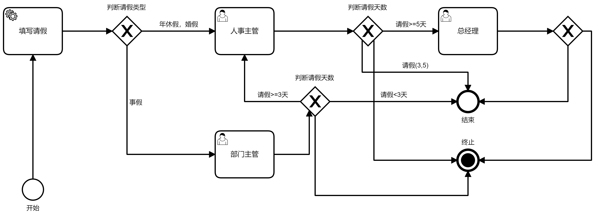

# camunda-bpm-spring-boot-example
# 初衷
由于公司项目使用了工作流，自己也是初次接触，为了加深理解，所以自己写了例子。主要参考了[camunda官方文档](https://docs.camunda.org/)

# 准备工作
- jdk1.8+
- 流程图工具[modeler](https://camunda.com/download/modeler/)
- [管理系统bpm](https://camunda.com/download/)
现在大多数java服务都会采用springboot的方式快速开发，同时，业务数据都会基于数据库。所以，上面的管理系统bpm**不是必须**，只需要集成到springboot中即可。下载的zip中sql文件夹下，需要自行提取sql文件。已经提取到项目中resource/sql中了。我这里使用的mysql数据库，所以建立了数据库`camunda`，再去执行`mysql_identity_7.13.0.sql`和`mysql_identity_7.13.0.sql`两个sql脚本，完成表的建立和数据的初始化工作。

# 说明
我们平常应该都接触过请假流程，在这里，就以请假流程为例，从0到1完成我们的流程开发。
使用工具  `modeler` 绘制流程图，完成后的效果大概是这样的



绘制好流程图后，导出为leave.bpmn文件，存放到resource路径中。

设置配置文件application.yml为如下内容
```
camunda.bpm:
  admin-user:
    id: demo
    password: demo
    firstName: Demo
  filter:
    create: All tasks

spring:
  datasource:
    driver-class-name: com.mysql.jdbc.Driver
    url: jdbc:mysql://localhost:3306/camunda?autoReconnect=true
    username: root
    password: root
```
编写`LeaveController`，其中三个方法如下
- apply 请假申请
- task 审批人查看自己的审批任务列表
- approval 审批请假流程

启动项目后，执行上面的方法就可以推动流程节点的流转。当请假流程发起后，可以登录[http://localhost:8080](http://localhost:8080)访问管理系统。用户名/密码为demo/demo，登录后，就可以查看taskList中的流程信息。